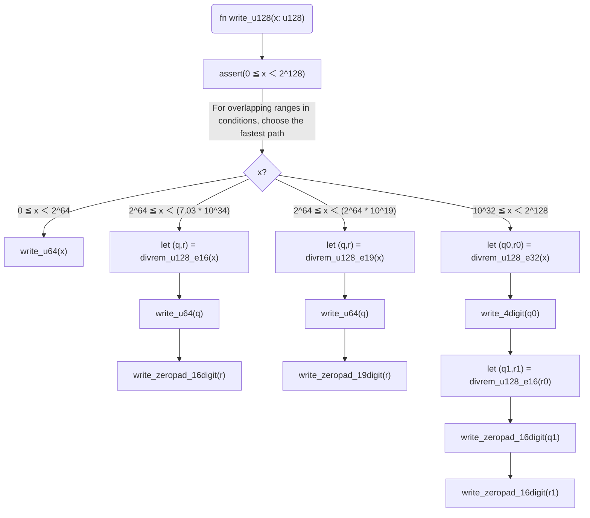
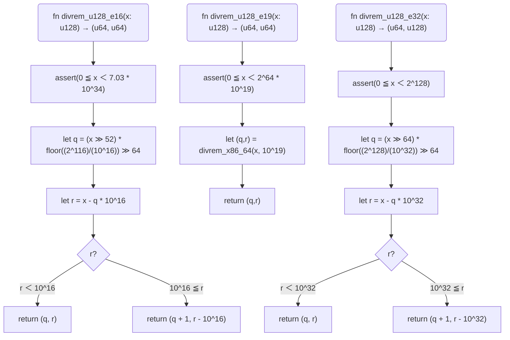
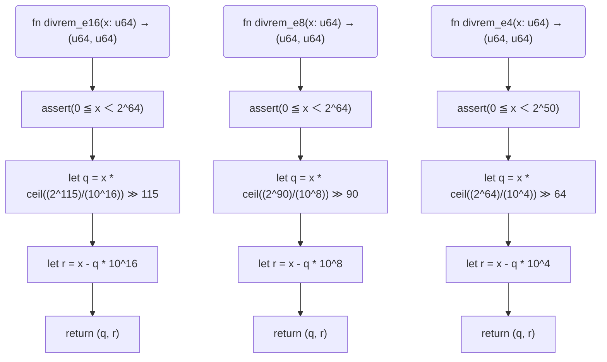
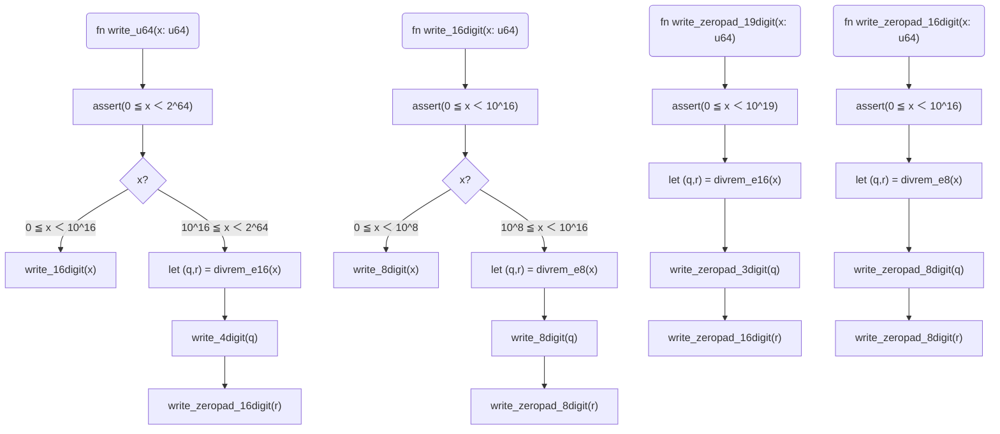
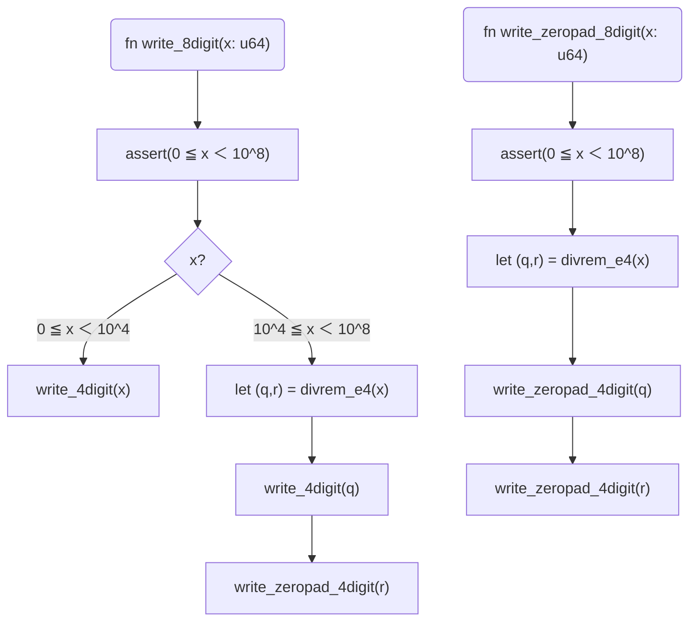
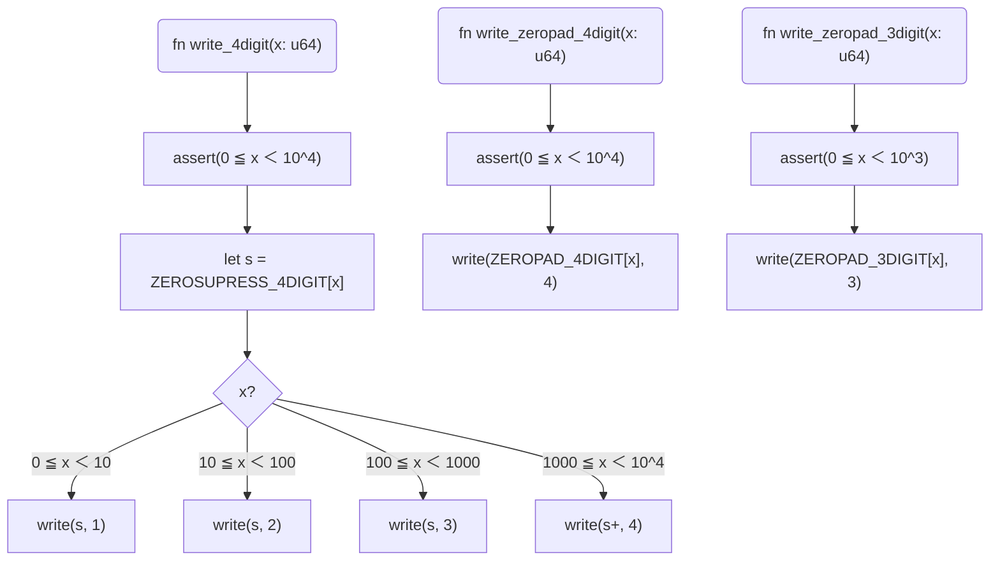

```mermaid
graph TD;
A("fn write_u128(x: u128)")
A --> A1["assert(0 ≦ x ＜ 2^128)"]
A1 -- "For overlapping ranges in conditions, choose the fastest path" --> A2{"x?"}
A2 -- "0 ≦ x ＜ 2^64" --> C0["write_u64(x)"]
A2 -- "2^64 ≦ x ＜ (7.03 * 10^34)" --> D1["let (q,r) = divrem_u128_e16(x)"]
D1 --> D2["write_u64(q)"]
D2 --> D3["write_zeropad_16digit(r)"]
A2 -- "2^64 ≦ x ＜ (2^64 * 10^19)" --> E1["let (q,r) = divrem_u128_e19(x)"]
E1 --> E2["write_u64(q)"]
E2 --> E3["write_zeropad_19digit(r)"]
A2 -- "10^32 ≦ x ＜ 2^128" --> F1["let (q0,r0) = divrem_u128_e32(x)"]
F1 --> F2["write_4digit(q0)"]
F2 --> F3["let (q1,r1) = divrem_u128_e16(r0)"]
F3 --> F4["write_zeropad_16digit(q1)"]
F4 --> F5["write_zeropad_16digit(r1)"]
```

---

```mermaid
graph TD;
G("fn divrem_u128_e16(x: u128) → (u64, u64)")
G --> G1["assert(0 ≦ x ＜ 7.03 * 10^34)"]
G1 --> G2["let q = (x ≫ 52) * floor((2^116)/(10^16)) ≫ 64"]
G2 --> G3["let r = x - q * 10^16"]
G3 --> G4{r?}
G4 -- "r ＜ 10^16" --> G5["return (q, r)"]
G4 -- "10^16 ≦ r" --> G6["return (q + 1, r - 10^16)"]
H("fn divrem_u128_e19(x: u128) → (u64, u64)")
H --> H1["assert(0 ≦ x ＜ 2^64 * 10^19)"]
H1 --> H2["let (q,r) = divrem_x86_64(x, 10^19)"]
H2 --> H3["return (q,r)"]
I("fn divrem_u128_e32(x: u128) → (u64, u128)")
I --> I1["assert(0 ≦ x ＜ 2^128)"]
I1 --> I2["let q = (x ≫ 64) * floor((2^128)/(10^32)) ≫ 64"]
I2 --> I3["let r = x - q * 10^32"]
I3 --> I4{r?}
I4 -- "r ＜ 10^32" --> I5["return (q, r)"]
I4 -- "10^32 ≦ r" --> I6["return (q + 1, r - 10^32)"]
```

---

```mermaid
graph TD;
M("fn divrem_e16(x: u64) → (u64, u64)")
M --> M1["assert(0 ≦ x ＜ 2^64)"]
M1 --> M2["let q = x * ceil((2^115)/(10^16)) ≫ 115"]
M2 --> M3["let r = x - q * 10^16"]
M3 --> M4["return (q, r)"]
N("fn divrem_e8(x: u64) → (u64, u64)")
N --> N1["assert(0 ≦ x ＜ 2^64)"]
N1 --> N2["let q = x * ceil((2^90)/(10^8)) ≫ 90"]
N2 --> N3["let r = x - q * 10^8"]
N3 --> N4["return (q, r)"]
O("fn divrem_e4(x: u64) → (u64, u64)")
O --> O1["assert(0 ≦ x ＜ 2^50)"]
O1 --> O2["let q = x * ceil((2^64)/(10^4)) ≫ 64"]
O2 --> O3["let r = x - q * 10^4"]
O3 --> O4["return (q, r)"]
```

---

```mermaid
graph TD;
J("fn write_u64(x: u64)")
J --> J1["assert(0 ≦ x ＜ 2^64)"]
J1 --> J2{"x?"}
J2 -- "0 ≦ x ＜ 10^16" --> J3["write_16digit(x)"]
J2 -- "10^16 ≦ x ＜ 2^64" --> J4["let (q,r) = divrem_e16(x)"]
J4 --> J5["write_4digit(q)"]
J5 --> J6["write_zeropad_16digit(r)"]
K("fn write_16digit(x: u64)")
K --> K1["assert(0 ≦ x ＜ 10^16)"]
K1 --> K2{x?}
K2 -- "0 ≦ x ＜ 10^8" --> K3["write_8digit(x)"]
K2 -- "10^8 ≦ x ＜ 10^16" --> K4["let (q,r) = divrem_e8(x)"]
K4 --> K5["write_8digit(q)"]
K5 --> K6["write_zeropad_8digit(r)"]
L("fn write_zeropad_19digit(x: u64)")
L --> L1["assert(0 ≦ x ＜ 10^19)"]
L1 --> L2["let (q,r) = divrem_e16(x)"]
L2 --> L3["write_zeropad_3digit(q)"]
L3 --> L4["write_zeropad_16digit(r)"]
M("fn write_zeropad_16digit(x: u64)")
M --> M1["assert(0 ≦ x ＜ 10^16)"]
M1 --> M2["let (q,r) = divrem_e8(x)"]
M2 --> M3["write_zeropad_8digit(q)"]
M3 --> M4["write_zeropad_8digit(r)"]
```

---

```mermaid
graph TD;
V("fn write_8digit(x: u64)")
V --> V1["assert(0 ≦ x ＜ 10^8)"]
V1 --> V2{x?}
V2 -- "0 ≦ x ＜ 10^4" --> V3["write_4digit(x)"]
V2 -- "10^4 ≦ x ＜ 10^8" --> V4["let (q,r) = divrem_e4(x)"]
V4 --> V5["write_4digit(q)"]
V5 --> V6["write_zeropad_4digit(r)"]
W("fn write_zeropad_8digit(x: u64)")
W --> W1["assert(0 ≦ x ＜ 10^8)"]
W1 --> W2["let (q,r) = divrem_e4(x)"]
W2 --> W3["write_zeropad_4digit(q)"]
W3 --> W4["write_zeropad_4digit(r)"]
```

---

```mermaid
graph TD;
X("fn write_4digit(x: u64)")
X --> X1["assert(0 ≦ x ＜ 10^4)"]
X1 --> X2["let s = ZEROSUPRESS_4DIGIT[x]"]
X2 --> X3{x?}
X3 -- "0 ≦ x ＜ 10" --> X4["write(s, 1)"]
X3 -- "10 ≦ x ＜ 100" --> X5["write(s, 2)"]
X3 -- "100 ≦ x ＜ 1000" --> X6["write(s, 3)"]
X3 -- "1000 ≦ x ＜ 10^4" --> X7["write(s+, 4)"]
Y("fn write_zeropad_4digit(x: u64)")
Y --> Y1["assert(0 ≦ x ＜ 10^4)"]
Y1 --> Y2["write(ZEROPAD_4DIGIT[x], 4)"]
Z("fn write_zeropad_3digit(x: u64)")
Z --> Z1["assert(0 ≦ x ＜ 10^3)"]
Z1 --> Z2["write(ZEROPAD_3DIGIT[x], 3)"]
```

